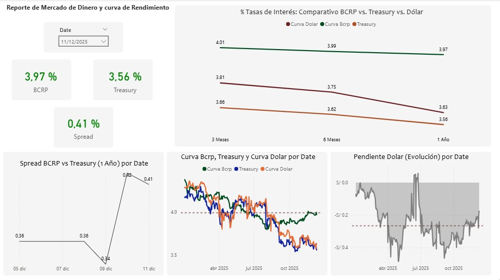

# Pipeline-end-to-end-Analisis-Financiero
Extraccion - Transformacion - Load - Reporte en BI


## Workflows

1. Data_Extraction (Extrae data de las diversas fuentes de Informacion)
2. Data_Preparation (Transforma y re-estructura la data)
3. Data_Gold (Almacen de data que previamente fue transformada)
4. Pipeline (Realiza la extraccion,transformacion y almacen de la data)
5. Caso 2 (Analisis de Data de Sura)


# Cómo ejecutarlo?
### Pasos:

Clona el repositorio

```bash
https://github.com/frankcc1/Pipeline-end-to-end-Analisis-Financiero.git
```
### PASO 01 – Crear un entorno venv después de abrir el repositorio

```bash
python -m venv env
```

### PASO 02 – Activar el repositorio

```bash
env\Scripts\activate
```


### PASO 03- Instalar los requerimientos
```bash
pip install -r requirements.txt
```
# Análisis


### Conclusiones 

El Fondo Sura Ultra Cash Soles demuestra, ser un instrumento idóneo para la Gestión 
de Tesorería Corporativa y para perfiles de inversión Conservadores. Su 
comportamiento descarta la exposición a riesgos de mercado significativos. 

Esta conclusión se sustenta en los siguientes hallazgos: 

• Perfil de Riesgo Nulo (VaR Positivo): El análisis de Valor en Riesgo (VaR) confirma 
la seguridad del activo en múltiples escenarios. Al 99% de confianza, el VaR es 
de +0.000437%, y al 97.5% de confianza, mejora a +0.005180%. Ambos 
resultados certifican que el fondo no proyecta pérdidas nominales. 

• Estabilidad (Volatilidad): La volatilidad anual de 0.0775% es inmaterial 
comparada con cualquier otro activo de renta fija o variable. Esto valida que el 
fondo inmuniza el capital contra la volatilidad de mercado. 

• Resiliencia Operativa (Drawdown): La prueba de estrés histórico (Maximum 
Drawdown) reveló una caída máxima de -0.04% en tres años, con una 
recuperación inmediata. Desde 2023 a la fecha, el Drawdown ha sido 0.00%, lo 
que demuestra una solidez absoluta ante choques de liquidez recientes. 

• Eficiencia en Captura de Tasas: Con una rentabilidad acumulada del 18.84% 
(aprox. 6.28% anual promedio), el instrumento ha logrado trasladar 
eficientemente las tasas de referencia altas del BCRP al inversor, superando la 
inflación promedio del periodo y preservando el poder adquisitivo de la caja.